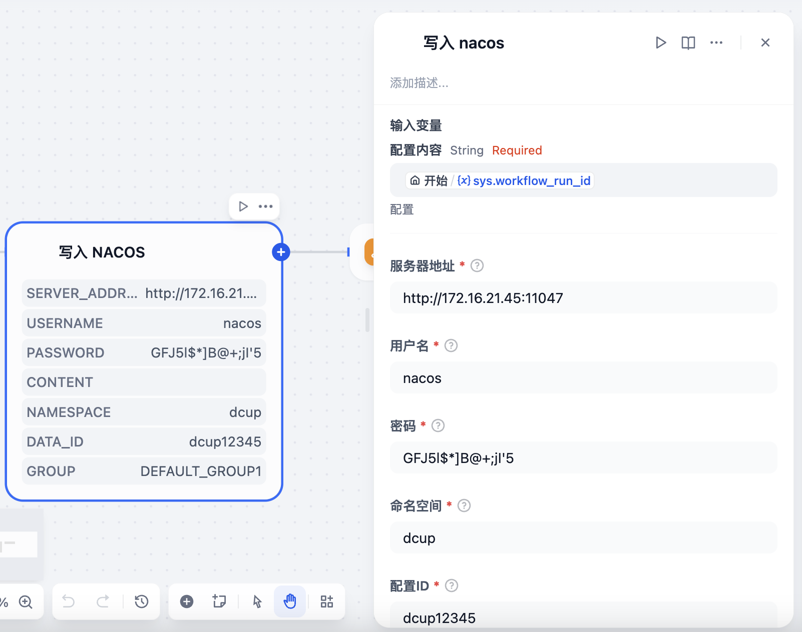
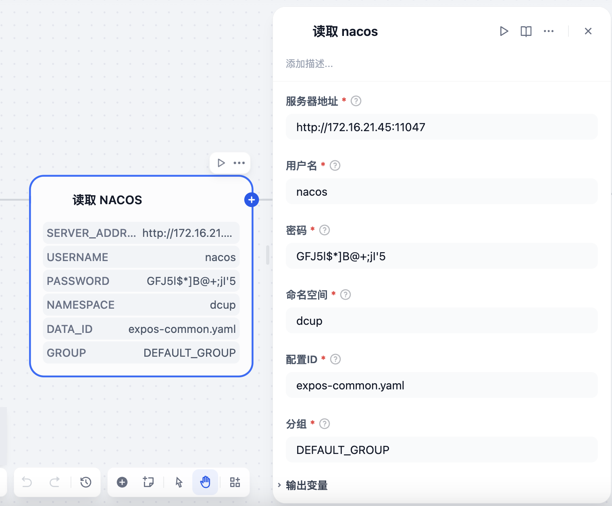

# Nacos Plugin

**Author:** [aias00](https://github.com/aias00)
**Version:** 0.0.1
**Type:** tool

## Description

### NacosWriter Plugin

The Nacos Writer Plugin allows users to write data into Nacos.

### Features

- Write data into Nacos and returns standard output and standard error

### Parameters

| Parameter | Type | Required | Description |
|-----------|------|----------|-------------|
| server_addresses | string | Yes | server addresses of the Nacos server |
| username | string | Yes | username of the Nacos server |
| password | string | Yes | password of the Nacos server |
| namespace | string | Yes | namespace of the Nacos server |
| data_id | string | Yes | data_id of the Nacos server |
| group | string | Yes | group of the Nacos server |
| content | string | Yes | Content to write into Nacos |

### NacosReader Plugin

The Nacos Reader Plugin allows users to read data from Nacos.

### Features

- Read data from Nacos and returns standard output and standard error

### Parameters

| Parameter | Type | Required | Description |
|-----------|------|----------|-------------|
| server_addresses | string | Yes | server addresses of the Nacos server |
| username | string | Yes | username of the Nacos server |
| password | string | Yes | password of the Nacos server |
| namespace | string | Yes | namespace of the Nacos server |
| data_id | string | Yes | data_id of the Nacos server |
| group | string | Yes | group of the Nacos server |

## Security Considerations

- Ensure you have permission to access the target server
- Sensitive information such as private keys and passwords should be kept secure
- Follow the principle of least privilege, granting only necessary execution permissions

## License

[MIT](./LICENSE)

